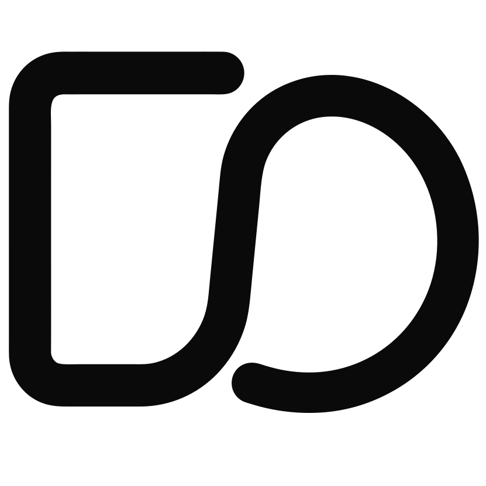
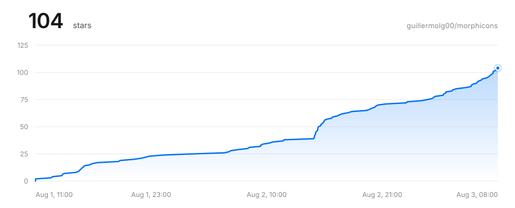

<p align="center">
  <a href="https://www.morphicons.com">
    <picture>
      <source media="(prefers-color-scheme: dark)" srcset="assets/logo-dark.svg">
      
    </picture>
  </a>
</p>

<h1 align="center">morphicons</h1>

<p align="center">
  <a href="https://www.morphicons.com"><strong>morphicons.com</strong></a> — live playground
</p>

Universal morphing for stroke-based icons (Lucide, Tabler, Heroicons, Iconoir, or your own paths): **any icon morphs into any other** with spring physics. Rotations are never declared by hand — they emerge from the math (2D Procrustes + polar interpolation). Zero runtime dependencies.

```tsx
import { MorphIcon } from "morphicons/react";
import { Menu, X } from "lucide"; // data, not components

<button onClick={() => setOpen(o => !o)} aria-expanded={open}>
  <MorphIcon icon={open ? X : Menu} />
</button>
```

That's the whole thing. No wrappers, no `AnimatePresence`, no keys, no from/to pairs, no configuration. State lives outside; the animation is an implementation detail the component picks up when the prop changes.

## Why

The usual icon morphs either interpolate raw coordinates (shapes shrink and shear in transit) or require hand-declaring "rotation groups" per icon pair. morphicons solves the optimal similarity between shapes in closed form and interpolates it in its natural space: if a pair is congruent under rotation, it **rotates**; if not, it morphs in the aligned frame. arrow-right → arrow-down yields θ = 90° on its own, without anyone declaring it.

## Install

```bash
bun add morphicons        # or npm install / pnpm add
```

ESM only. `react` (>= 18) and `vue` (>= 3.3) are optional peers — only needed for `morphicons/react` and `morphicons/vue`.

## Usage

### React — three modes

```tsx
import { MorphIcon, type MorphHandle } from "morphicons/react";

// 1. Uncontrolled (90% of uses): change the prop and morphicons animates
<MorphIcon icon={open ? X : Menu} spring="snappy" />

// 2. Controlled (gestures, scroll): explicit progress, no spring
<MorphIcon from={Menu} to={X} progress={dragProgress} />

// 3. Imperative (sequences)
const ref = useRef<MorphHandle>(null);
<MorphIcon ref={ref} icon={Menu} />
ref.current?.morphTo(Check); // animates
ref.current?.set(X);         // jumps without animating
```

Drop-in replacement for lucide-react: `size`, `strokeWidth`, `absoluteStrokeWidth`, `color`, `className` and the rest of the `<svg>` props pass straight through. Correct accessibility by default: `aria-hidden` unless you pass `label` (→ `role="img"` + `<title>`). Clean SSR: the server emits the exact static SVG (zero flash, zero layout shift); the runtime is born on hydration. `prefers-reduced-motion` degrades to an instant swap.

### Vue — same three modes

```vue
<script setup lang="ts">
import { ref } from "vue";
import { MorphIcon, type MorphHandle } from "morphicons/vue";
import { Menu, X, Check } from "lucide"; // data, not components

const open = ref(false);
const morph = ref<MorphHandle | null>(null);
// morph.value?.morphTo(Check)  → animates
// morph.value?.set(X)          → jumps without animating
</script>

<template>
  <!-- 1. Uncontrolled (90% of uses): change the prop and morphicons animates -->
  <MorphIcon :icon="open ? X : Menu" spring="snappy" />

  <!-- 2. Controlled (gestures, scroll): explicit progress, no spring -->
  <MorphIcon :from="Menu" :to="X" :progress="dragProgress" />

  <!-- 3. Imperative (sequences): template ref → morphTo / set -->
  <MorphIcon ref="morph" :icon="Menu" />
</template>
```

Same surface as the React binding: presentation props (`size`, `strokeWidth`, `absoluteStrokeWidth`, `color`; `class`, `style` and the rest of the `<svg>` attrs fall through), the same accessibility defaults (`aria-hidden` unless you pass `label`) and the same clean SSR — works with Nuxt out of the box: the server emits the exact static SVG and the runtime is born on hydration. The binding is a plain render function; no SFC compiler or JSX involved.

### Vanilla (no React)

```ts
import { createMorph } from "morphicons/dom";

const m = createMorph(pathEl, Menu); // pathEl: any object with setAttribute
m.morphTo(X, "snappy");              // preset or { stiffness, damping }
m.set(Check);                        // jump without animating (canonical d)
m.seek(X, 0.4);                      // morph frozen at t — scrubbing, gestures
m.progress = 0.4;                    // sugar: seek on the active target
m.destroy();
```

Truly interruptible: a `morphTo` mid-flight re-plans from the current intermediate shape while preserving the spring's velocity — click spam never jumps. A single global `requestAnimationFrame` drives all instances.

### Pure core (no DOM)

```ts
import { resampleIcon, buildPlan, interpPolar, allocOutputs, serialize } from "morphicons";

const plan = buildPlan(resampleIcon(Menu), resampleIcon(X)); // cacheable
const out = allocOutputs(plan);
interpPolar(plan, 0.5, out);                                 // t ∈ [0, 1]
const d = serialize(out, plan.items.map(it => it.closed));   // `d` attribute
```

Accepts `IconNode` (Lucide's data format, structurally typed — Lucide is neither a dependency nor a peer) or a raw `d` attribute. Tabler, Heroicons, Iconoir and custom paths work the same.

## Icon library compatibility

morphicons has no per-library adapters — any icon set that meets these requirements works out of the box:

1. **Stroke-drawn icons.** The geometry must be the stroked centerline (`fill="none"`, color via `stroke`). The whole pipeline — resampling, correspondence, in-flight polylines — assumes strokes; filled or outlined-fill glyphs (Material Symbols, Bootstrap Icons, Remix Icon, Phosphor, Heroicons *solid*) parse fine but won't read correctly in transit.
2. **Geometry available as data.** Either a raw `d` attribute per icon, or a `[tag, attrs][]` node list (Lucide's IconNode shape) using only `path`, `line`, `circle`, `ellipse`, `rect`, `polyline`, `polygon`. No `<g>` wrappers and no `transform` attributes — coordinates must be literal. Any other tag throws a clear error.
3. **A shared coordinate space per pair.** Both endpoints of a morph must live on the same grid. Lucide, Tabler, Heroicons and Iconoir all draw on 24×24 — that's why cross-library morphs just work. For a pack on another canvas (Heroicons *solid* on 20, Carbon on 32, Teenyicons on 15), re-grid it once with `fitIcon`:

   ```ts
   import { fitIcon } from "morphicons";

   const search = fitIcon(carbonSearch, 32);   // 32×32 → the 24 grid
   const bell   = fitIcon(teenySmallBell, 15); // also "0 0 15 15" or [0, 0, 15, 15]
   ```

   It returns a plain `d`, so it goes anywhere an icon is accepted. Call it at module scope, not per render. Skipping it doesn't throw — Procrustes is similarity-invariant, so the grid mismatch never reads as false rotation; it lands in σ as an unwanted zoom, and the target draws outside the canvas. The React and Vue bindings default to `viewBox="0 0 24 24"`, overridable via props.
4. **Uniform stroke.** Cosmetic rather than structural: a consistent stroke width and round caps/joins make in-flight shapes look native. These live on the `<svg>`, not in morphicons.

Beyond the libraries in the playground, sets known to qualify on the 24×24 grid — no fitting needed: **Heroicons** (outline style), **Iconoir** (1.5px stroke), **Akar Icons**, **Untitled UI** and **Hugeicons** (stroke style). Off-grid packs work through `fitIcon`: **Teenyicons** (15×15), **Carbon** (32×32), **Heroicons solid** (20×20).

This also covers the [shadcn registry](https://www.shadcn.io/icons), which re-publishes 200+ icon libraries as React components with an inline `<path d>` — pass that `d` straight in, adding `fitIcon` when the pack's `viewBox` isn't 24.

## Architecture

```
┌─────────────────────────────────────────────┐
│  bindings   react · vue                     │  thin: ref + createMorph
├─────────────────────────────────────────────┤
│  drivers    dom (setAttribute + rAF)        │  singleton scheduler
├─────────────────────────────────────────────┤
│  core       parse → normalize → resample    │  pure functions,
│             → match → align → plan          │  NO DOM, produce
│             → interpolate → serialize       │  `d` strings and numbers
│             + spring                        │
└─────────────────────────────────────────────┘
```

The hard rule: **the core never touches the DOM**. Pure functions consume icon data and produce `d` strings. Direct consequence: a React Native driver over `react-native-svg` + Reanimated is just another adapter, not a rewrite. One package with subpath exports (`.` core, `./dom`, `./react`, `./vue`), ESM only, `sideEffects: false`.

The plan is the central artifact:

```
icon A ─┐
        ├→ normalize → resample → match → align → PLAN ─→ interpolate(t) → serialize → d
icon B ─┘                                           ↑
                                        cacheable, serializable
```

`plan()` accepts any list of sampled subpaths — not just canonical icons — which is what makes interruptions free: the currently rendered buffers are a valid morph source.

## How the math works

### 1. Normalization — everything to cubic Béziers

Every SVG primitive is reduced to cubic segments:

- **Line** → cubic with collinear controls: `C₁ = P₀ + ⅓(P₃−P₀)`, `C₂ = P₀ + ⅔(P₃−P₀)`.
- **Quadratic** → exact degree elevation: `C₁ = Q₀ + ⅔(Q₁−Q₀)`, `C₂ = Q₂ + ⅔(Q₁−Q₂)`.
- **Circle** → 4 cubics with offset `k = r·(4/3)·tan(π/8) ≈ 0.5523·r`.
- **Arc `A`** → center parametrization (SVG spec, appendix F.6), sliced into arcs ≤ 90°, each slice to a cubic with `α = (4/3)·tan(Δθ/4)`.
- **rect/polyline/polygon** → lines (rounded rects: lines + quarter ellipses).

The `d` parser handles absolute/relative commands, H/V/S/T shorthands, packed arc flags and scientific notation. Result: icon = list of subpaths; subpath = chain of cubics + closed/open flag.

### 2. Resampling — arc length with anchored corners

Instead of fighting Bézier structures of different cardinality, every subpath is sampled at **N points equidistant by arc length** (N = 64). Every subpath becomes a `Float64Array(2N)` and the structural problem disappears: correspondence is index to index.

The arc length of a cubic has no closed form; `|B′(t)|` is integrated with 8-point Gauss-Legendre quadrature per segment.

The refinement that drives quality: **corner detection** (tangent discontinuity above an angular threshold) with corners anchored as exact sample points. Remaining points are apportioned by arc length between corners — integer apportionment by largest remainder, minimum 1 interval per run, summing exactly to N−1. Effects:

- At rest the shape is **exact** (a check's vertex is a sample, not an approximation).
- In transit, source corners flatten smoothly and target corners sharpen — the desired behavior. Without anchoring, a morphing check visibly rounds its corners.

Closed paths anchor **only corners**, not the arbitrary `M` start point — sampling is intrinsic to the shape, so two congruent loops with different start points produce the same sample set (modulo index rotation, resolved by the circular correspondence below).

### 3. Correspondence

Three subproblems:

- **Orientation.** Both traversal directions of B are tried and scored (see the tie-break below). A hamburger line folding to the correct diagonal depends on this.
- **Start point (closed paths).** A closed contour has a circular degree of freedom: which index is "first". The N circular offsets × 2 directions are tried and the best post-alignment score wins. O(N²) brute force with N = 64 is ~4K operations per pair — negligible.
- **Subpath matching.** With p subpaths in A and q in B, pairing cost is `dist(centroids) + 0.35·|ΔL|` (arc lengths). Equal counts use the minimum-cost permutation (exhaustive with pruning up to 8 subpaths, greedy above); unequal counts use a **surjective** assignment from the large side to the small one, so no subpath ever appears or disappears out of nowhere. Leftovers are **not collapsed to a point**: the nearest subpath is **duplicated** in place and the copies separate in flight — it reads as cell division, far more natural than growing from nothing. At rest, overlapping duplicates with the same solid stroke are invisible, and the canonical snap on settle resets the count.

### 4. Alignment — 2D Procrustes

Before interpolating, the **optimal similarity** (rotation θ, scale σ, translation) mapping A onto B is computed by minimizing `Σ|σ·R(θ)·(aᵢ−c_A) − (bᵢ−c_B)|²`. In 2D it has a closed form, no SVD:

```
S_xx = Σ aₓbₓ    S_xy = Σ aₓbᵧ    (centered clouds)
S_yx = Σ aᵧbₓ    S_yy = Σ aᵧbᵧ

θ* = atan2(S_xy − S_yx,  S_xx + S_yy)
σ* = [cos θ*·(S_xx+S_yy) + sin θ*·(S_xy−S_yx)] / Σ‖aᵢ‖²
```

The normalized RMS **residual** after alignment (`res = √(Σ|σRa−b|² / Σ‖b‖²)`) is the shape metric: ≈ 0 means A and B are the same shape rotated/scaled. This turns rotation groups into an **emergent property**: arrow-right → arrow-down gives residual ~0 with θ = 90° and the system chooses pure rotation on its own.

Procrustes runs **per subpath** (each piece rotates around its own centroid, which translates independently) — this gives local, organic motion: a hamburger *folds* instead of spinning as a block. A **global hybrid** pass then runs Procrustes over the concatenated clouds: if the global residual is ≈ 0 (< 5e-3) the whole icon is congruent and every subpath shares the same (θ, σ), so e.g. both subpaths of an arrow spin the same way.

#### Minimal-rotation tie-break

For shapes symmetric under inversion (a straight line), both traversal orientations give residual 0 — indistinguishable to Procrustes — but produce different rotations. Naive tie-breaking can pick θ = 135° when the inverted orientation gives θ = −45° with the same end result. Each orientation is scored with:

```
score = res + λ·|θ|/π      (λ = 0.05)
```

Deformation is minimized first and, at comparable residuals, the shortest rotation wins. λ is small enough that a notably worse shape never wins just by rotating less. This is the kind of detail the math doesn't see but the eye does.

### 5. Polar interpolation

Raw coordinate lerp **collapses rotations**: points take the chord, the shape shrinks and shears in transit. The fix: decompose the motion into similarity + residual and interpolate each part in its natural space.

Let `aᶜᵢ = aᵢ − c_A` and `b̃ᵢ = R(−θ*)·(bᵢ − c_B)/σ*` (B brought into A's frame). Then:

```
P(t) = c(t) + σ*ᵗ · R(t·θ*) · [(1−t)·aᶜᵢ + t·b̃ᵢ]

  c(t)  = lerp(c_A, c_B, t)        linear translation (block transport under the global hybrid — below)
  t·θ*  = linear angle             (θ* is already in (−π, π], short path)
  σ*ᵗ   = exp(t·ln σ*)             log-linear scale (geodesic in ℝ⁺)
```

Exact at both endpoints (max error ~3.6e-15 in tests). Properties:

- If B is A rotated (residual 0), the bracket is constant and the motion is **pure rotation**.
- If there is no rotation, it's a clean coordinate morph.
- Mixed cases do both simultaneously and continuously.
- With spring overshoot (t > 1) the formula **extrapolates** naturally: rotation and scale overshoot slightly and come back — free juice.

**Block transport (global hybrid).** When the whole icon is congruent (§4), lerping each subpath centroid reintroduces the chord disease one level up: every part spins with the shared θ*, but an off-center part travels the chord — inside the arc — and drifts toward the center mid-flight. An arrow's head sagged ~1 px toward its shaft at t = 0.5 (`r·(1 − cos(θ/2))` with r = 3.5, θ = 90°) while both parts rotated perfectly. Under the hybrid, each centroid rides the shared similarity around the global centroid `g_A` instead:

```
c_k(t) = c_{A,k} + t·d_k + (σ*ᵗ·R(t·θ*) − I)·(c_{A,k} − g_A)
```

`d_k` is fixed once so that `c_k(1) = c_{B,k}` exactly (it absorbs the tiny global residual). Every point of every subpath then moves under ONE similarity per frame: congruent icons are rigid through the whole flight, not only at the endpoints. With θ* = 0, or centroids sitting on `g_A`, or no hybrid at all, the formula degrades continuously to the plain lerp — no thresholds, no special cases.

### 6. Serialization and canonical snap

In flight, each subpath is emitted as `M x y L x y …` (+ `Z` if the pair is closed↔closed; closed→open flies open, the loop opening at the cut chosen by the circular correspondence) with 2 decimals — invisible at 24px, and the frame's only allocation. On settle, the driver **snaps to the canonical `d`** of the target icon: exact fidelity at rest (real curves, not polylines), subpath count reset after duplications, and the DOM ends up identical to a static icon's. The jump is < 0.02px — imperceptible.

### 7. The spring

Damped harmonic oscillator over progress `x: 0 → 1`:

```
ẍ = k·(1 − x) − c·ẋ
```

Integrated with **semi-implicit Euler** at h = 1/240 s substeps (stable up to ω·h ≈ 2; with k = 420, ω ≈ 20.5 — ample margin). ~25 lines, no animation library needed.

| preset | k | c | ζ = c/(2√k) | character |
|--------|-----|-----|------|-----------|
| smooth | 170 | 26 | 1.00 | critically damped, no overshoot |
| snappy | 420 | 30 | 0.73 | fast, subtle overshoot |
| bouncy | 300 | 14 | 0.40 | playful |

**Interruptions**: when a `morphTo` arrives mid-flight, the plan is rebuilt from the current intermediate shape (the rendered buffers are already N points per subpath — they serve directly as source), `x` resets to 0 and **velocity is preserved** (clamped to ±14). Perceived motion is continuous; tap spam feels alive, never jumps. The spring settles and the rAF stops when `|1−x| < 0.001 ∧ |v| < 0.02`.

## Performance

- `plan(A, B)` complete (resample + match + Procrustes × orientations): **sub-millisecond** with N = 64 — measured 0.01 ms (open paths) to 0.06 ms (closed, with circular search); 0.42 ms for a pathological 12-loops case.
- **Zero numeric allocation per frame**: interpolators write into the plan's preallocated `Float64Array`s. Only the `d` string is allocated.
- **Caches by reference**: `normalize(icon)` in a WeakMap keyed by the IconNode (Lucide imports are stable references → no string keys, GC-friendly). `plan(A, B)` in a nested WeakMap; plans from interruptions are never cached.
- **One global rAF** (singleton scheduler): active instances are iterated, settled ones unregister. A hundred icons morphing at once = one loop.

## Size

CI budget (size-limit, gzip) as an anti-regression tripwire — gates carry ~10% headroom over what's measured; if a real capability needs more, the number is renegotiated, but growing unnoticed is not accepted:

| entry | measured | gate |
|---|---|---|
| `morphicons` (core) | 6.60 KB | 7 KB |
| `morphicons/dom` (core + driver) | 7.04 KB | 7.5 KB |
| `morphicons/react` (all, react external) | 7.77 KB | 8.5 KB |
| `morphicons/vue` (all, vue external) | 7.81 KB | 8.5 KB |

## Playground

```bash
bun run play   # → http://localhost:3000
```

38 real icons from Lucide (IconNode imported from the package), Feather and Tabler; per-pair readout of the detected similarity (θ, σ, residual), polar/linear modes for comparison, spring presets and a t scrubber. Feather/Tabler data is extracted from the npm packages with `bun playground/extract-vendor-icons.mjs`.

## Development

```bash
bun test          # 92 tests / ~13,500 asserts
bun run typecheck # strict ×4: core+dom without lib DOM, playground, react, vue
bun run format    # biome
bun run build     # tsdown → dist/ (entries index, dom, react, vue)
bun run size      # size gates
```

Icons shown in the playground belong to their authors: [Lucide](https://lucide.dev) (ISC), [Feather](https://feathericons.com) (MIT), [Tabler](https://tabler.io/icons) (MIT).

## Star history

<p align="center">
  <a href="https://github.com/guillermolg00/morphicons/stargazers">
    <picture>
      <source media="(prefers-color-scheme: dark)" srcset="assets/star-history-dark.svg">
      
    </picture>
  </a>
</p>

Rendered from the repo's own stargazer data — regenerate with `bun run stars`. Self-hosted on purpose: the third-party chart services rate-limit their shared GitHub tokens and answer 503, and GitHub's image proxy caches that failure, so the README ends up showing a broken image.

---

MIT © [Guillermo](https://guillermolg.com) — made by [guillermolg.com](https://guillermolg.com)
